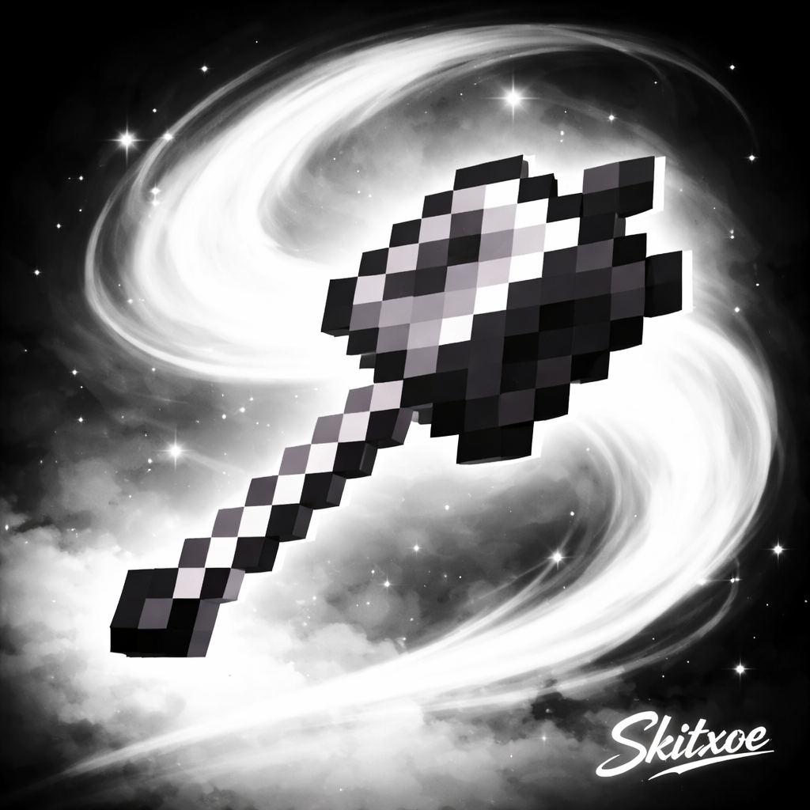

  

<h1 align="center">☁️ SkitMC | Skitxoe</h1>

  <em>"Living in the dark, watching every move. You won’t know I’m there until your heart beat is gone."</em>

  <strong>Minecraft Player • Developer • Server Owner</strong>

  
  

---

### 🏗️ EchoDupeLS Ecosystem

  <strong>IP: <code>EchoDupeLS.Minehut.gg</code></strong>
    
  Official resources for the <strong>EchoDupeLS</strong> community:

  <a href="https://echodupe.pages.dev/"><b>🌐 Main Website</b></a> • 
  <a href="https://echodupe.github.io/Summary/"><b>📄 Server Summary</b></a> • 
  <a href="https://echodupe.github.io/Games/"><b>🎮 Server Games</b></a>

  

---

### 👤 Profile

I'm <strong>SkitMC</strong>, known on Discord and GitHub as a developer and coder. 
 In-game, you’ll find me as <strong>Skitxoe</strong> (or just <strong>Skit</strong>). 
 I have a long history in the "Dupe" scene, previously owning <strong>VoidDupes</strong>.

---

### 🔗 Identity

  <b>GitHub/Discord:</b> SkitMC  
  <b>Minecraft IGN:</b> Skitxoe / Skit

  

